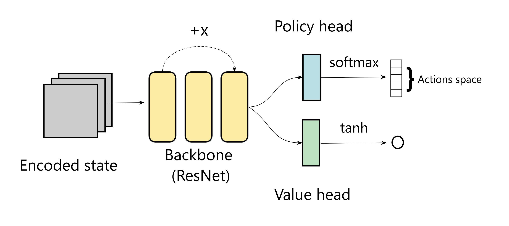

# ♟️ AlphaOne: A From-Scratch AlphaZero Implementation


## 1. Introduction

**AlphaOne** is a from-scratch implementation of AlphaZero in Python, compatible with OpenSpiel, a collection of game environments developed by Google DeepMind. This repository was created for research, education, or simply to improve one's Elo rating on chess.com ;).

At the core of [AlphaZero](https://arxiv.org/pdf/1712.01815) lies **Monte Carlo Tree Search** (MCTS), a heuristic search algorithm used for decision making. In this implementation, MCTS explores the most promising moves to generate training data for the ResNet, helping it refine the policy over time. **ResNet** is used to estimate both the policy and the value function.

<div align="center">
  
</div>


### 🎮 Supported Games

This repository currently includes full support for:

- **Tic-Tac-Toe**
- **Chess**


## 2. Quick Setup 

### OpenSpiel on Windows

Since OpenSpiel is only compatible with **Linux** and **macOS**, it is recommended that **Windows users install WSL2 (Windows Subsystem for Linux 2)** to ensure proper functionality.  

You can find more detailed instructions in the official documentation:   [OpenSpiel Installation Guide](https://github.com/google-deepmind/open_spiel/blob/master/docs/install.md)

### Python Dependencies

All required Python packages are listed in the provided `requirements.txt` file.

```bash
# make a virtual venv and install packages 
python3 -m venv venv
source venv/bin/activate
pip install -r requirements.txt
```

### Train

You can train a model with :

```bash
python3 src/train.py --game_name=chess 
```

### Play

The interface for Tic-Tac-Toe is already implemented, once the model is trained and stored in `save/`, you can play by running `Play_TicTacToe.py`.

## 3. Adding Support for New Games

To use this algorithm with other OpenSpiel games, you need to create a new class similar to those found in the `games/` directory. Further explanations are provided in the file `games`.


## 4. References

- [`Mastering Chess and Shogi by Self-Play with a General Reinforcement Learning Algorithm`](https://arxiv.org/pdf/1712.01815)
- [`OpenSpiel: A Framework for Reinforcement Learning in Games`](https://arxiv.org/abs/1908.09453)
- [`Youtube : AlphaZero from Scratch by Robert Förster`](https://www.youtube.com/watch?v=wuSQpLinRB4&ab_channel=freeCodeCamp.org)